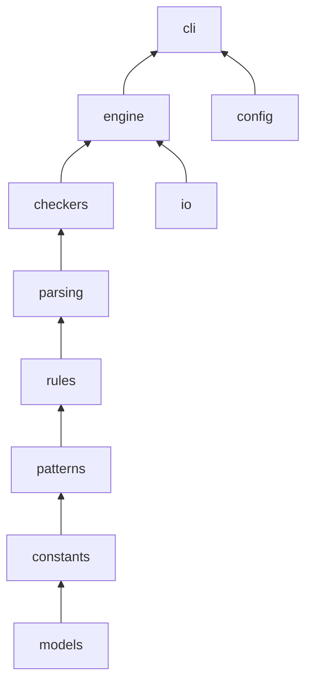

# Blinter

**Blinter** is a linter for Windows batch files (`.bat` and `.cmd`). It provides comprehensive static analysis to identify syntax errors, security vulnerabilities, performance issues and style problems. Blinter helps you write safer, more reliable and maintainable batch scripts. Even in 2026, batch files deserve professional tooling!

- ✅ **Configurable Options** - Configurable rules, `--verbose`/`--quiet` logging, robust error handling
- ✅ **Unicode Support** - Support for international characters and filenames
- ✅ **Performance Optimized** - Handles large batch files efficiently

## Features ✨

### 🔍 **Rule Categories**
- **Built-in Rules** -- the registry currently ships **147** rules across 5 severity levels (see `blinter.rules.registry.RULE_COUNT`; numbering gaps reflect retired or consolidated rule IDs)
- **Error Level (E001-E999)**: Critical syntax errors that prevent execution
- **Warning Level (W001-W999)**: Potential runtime issues and bad practices
- **Style Level (S001-S999)**: Code formatting and readability improvements
- **Security Level (SEC001+)**: Security vulnerabilities and dangerous operations
- **Performance Level (P001-P999)**: Optimization opportunities and efficiency improvements

📖 **For complete rule descriptions with examples and implementation details, see [Batch-File-Linter-Requirements.md](https://github.com/tboy1337/Blinter/blob/main/docs/Batch-File-Linter-Requirements.md)**

### 📋 **Output Format**
- **Rule Codes**: Each issue has a unique identifier (e.g., E002, W005, SEC003)
- **Clear Explanations**: Detailed descriptions of why each issue matters
- **Actionable Recommendations**: Specific guidance on how to fix problems
- **Line-by-Line Analysis**: Precise location of every issue
- **Context Information**: Additional details about detected problems

### 🚀 **Advanced Analysis**
- **Static Code Analysis**: Detects unreachable code and logic errors
- **Advanced Variable Expansion**: Validates percent-tilde syntax (%~n1), string operations, and SET /A arithmetic
- **Command-Specific Validation**: FOR loop variations, IF statement best practices, deprecated command detection
- **Variable Tracking**: Identifies undefined variables and unsafe usage patterns
- **Security Scanning**: Path traversal attacks, command injection risks, unsafe temp file creation
- **Performance Optimization**: DIR flag optimization, unnecessary output detection, string operation efficiency
- **Cross-Platform Compatibility**: Warns about Windows version issues and deprecated commands
- **Large File Handling**: Efficiently processes large batch files with performance monitoring
- **Robust Encoding Detection**: Handles UTF-8, UTF-16, Latin-1 and 6 more encoding formats
- **Advanced Escaping Techniques**: Validates caret escape sequences, multilevel escaping, and continuation characters
- **Professional FOR Command Analysis**: Checks for usebackq, proper tokenizing, delimiters, and skip options
- **Process Management Best Practices**: Timeout command usage, process verification, and restart patterns
- **Enhanced Security Patterns**: User input validation, temporary file security, and self-modification detection

## Installation 🛠️

### 🚀 Quick Start (Recommended)

**Option 1: Install via pip (Recommended)**
```cmd
pip install Blinter
```

**Option 2: Download standalone executable**
- Download the latest `Blinter-v1.0.x.zip` from [GitHub Releases](https://github.com/tboy1337/Blinter/releases)
- ⚠️ **Note**: Some antivirus software may flag the executable as a false positive due to PyInstaller's runtime unpacking behavior. The executable is completely safe (all source code is open for inspection). **We recommend using pip installation to avoid this issue.**

### 🔧 Manual Installation

1. Clone the repository:
```cmd
git clone https://github.com/tboy1337/Blinter.git
cd Blinter
```

2. (Optional) Create a virtual environment:
```cmd
python -m venv venv
venv\Scripts\activate.bat
```

3. Install development dependencies (includes runtime deps):
```cmd
pip install -e ".[dev]"
```

### Prerequisites
- **Python 3.12+** (required for pip installation and development)
- **Windows OS** (required for standalone executable)

## Usage 📟

### Basic Usage

**If installed via pip:**
```cmd
# Analyze a single batch file
blinter script.bat
# or
python -m blinter script.bat

# Analyze all batch files in a directory (recursive)
python -m blinter /path/to/batch/files

# Analyze batch files in directory only (non-recursive)
python -m blinter /path/to/batch/files --no-recursive

# Analyze with summary
python -m blinter script.bat --summary

# Analyze script and scripts it calls with shared variable context
python -m blinter script.bat --follow-calls

# Analyze with custom maximum line length
python -m blinter script.bat --max-line-length 120

# Create configuration file
python -m blinter --create-config

# Ignore configuration file
python -m blinter script.bat --no-config

# Get help
python -m blinter --help

# Get version
python -m blinter --version
```

**If using standalone executable:**
```cmd
# Analyze a single batch file
Blinter-v1.0.x.exe script.bat

# Analyze all batch files in a directory (recursive)
Blinter-v1.0.x.exe /path/to/batch/files

# Analyze batch files in directory only (non-recursive)
Blinter-v1.0.x.exe /path/to/batch/files --no-recursive

# Analyze with summary
Blinter-v1.0.x.exe script.bat --summary

# Analyze script and scripts it calls with shared variable context
Blinter-v1.0.x.exe script.bat --follow-calls

# Analyze with custom maximum line length
Blinter-v1.0.x.exe script.bat --max-line-length 120

# Get help
Blinter-v1.0.x.exe --help

# Get version
Blinter-v1.0.x.exe --version
```

**If using a local development install:**
```cmd
pip install -e .

# Analyze a single batch file
blinter script.bat

# Analyze all batch files in a directory (recursive)
blinter /path/to/batch/files

# Analyze batch files in directory only (non-recursive)
blinter /path/to/batch/files --no-recursive

# Analyze with summary
blinter script.bat --summary

# Analyze script and scripts it calls with shared variable context
blinter script.bat --follow-calls

# Analyze with custom maximum line length
blinter script.bat --max-line-length 120

# Create configuration file
blinter --create-config

# Ignore configuration file
blinter script.bat --no-config

# Get help
blinter --help

# Get version
blinter --version
```

### Command Line Options

- `<path>`: Path to a batch file (`.bat` or `.cmd`) OR directory containing batch files
- `--summary`: Display summary statistics of issues found
- `--severity`: Deprecated legacy flag (emits a warning, no effect); use `min_severity` in `blinter.ini` instead
- `--max-line-length <n>`: Set maximum line length for S011 rule (default: 100)
- `--no-recursive`: When processing directories, only analyze files in the specified directory (not subdirectories)
- `--follow-calls`: Automatically analyze scripts called by CALL statements and merge their variable context. When enabled, variables defined in called scripts (including transitively called scripts within depth and file limits) are recognized as "defined" in the calling script (position-aware: only after the CALL statement). This eliminates false positive undefined variable errors for configuration scripts
- `--config <path>`: Load settings from a custom configuration file instead of `blinter.ini` in the current directory
- `--no-config`: Don't use configuration file (blinter.ini) even if it exists
- `--create-config`: Create a default blinter.ini configuration file and exit
- `--create-config --force`: Overwrite an existing blinter.ini when creating the default configuration
- `--verbose`: Show detailed logging output (INFO level)
- `--quiet`: Suppress non-error logging output (ERROR level only)
- `--help`: Show help menu and rule categories
- `--version`: Display version information

**Note:** Command line options override configuration file settings. Blinter automatically looks for `blinter.ini` in the current directory.

### Configuration File Options 📝

| Section | Setting | Description | Default |
|---------|---------|-------------|---------|
| `[general]` | `recursive` | Search subdirectories when analyzing folders | `true` |
| `[general]` | `show_summary` | Display summary statistics after analysis | `false` |
| `[general]` | `max_line_length` | Maximum line length for S011 rule | `100` |
| `[general]` | `max_scan_files` | Maximum batch files to scan in a directory | `1000` |
| `[general]` | `follow_calls` | Analyze scripts called by CALL statements with shared variable context | `false` |
| `[general]` | `min_severity` | Minimum severity level to report | None (all) |
| `[rules]` | `enabled_rules` | Comma-separated list of rules to enable exclusively | None (all enabled) |
| `[rules]` | `disabled_rules` | Comma-separated list of rules to disable | None |

**Configuration notes:**
- When both `enabled_rules` and `disabled_rules` are set, a rule must appear in `enabled_rules` to run; `disabled_rules` then removes matches from that allowlist.
- `max_line_length` in `blinter.ini` controls style rules S011/S020 (default `100`). The hard read limit for individual lines is `10,000` characters (`MAX_LINE_LENGTH` in the engine); lines longer than that are rejected before linting.

**Rule migration:** Style rule `S006` was merged into `S022`. If your `blinter.ini` references `S006` in `enabled_rules` or `disabled_rules`, use `S022` instead.

### Command Line Override

Command line options always override configuration file settings:

```cmd
# Use config file settings
python -m blinter myscript.bat

# Override config to show summary
python -m blinter myscript.bat --summary

# Analyze script and scripts it calls with shared variable context
python -m blinter myscript.bat --follow-calls

# Override config with custom line length
python -m blinter myscript.bat --max-line-length 100

# Ignore config file completely
python -m blinter myscript.bat --no-config
```

### 🔕 Inline Suppression Comments

You can suppress specific linter warnings directly in your batch files using special comments:

#### Suppress Next Line
```batch
REM LINT:IGNORE E009
ECHO '' .... Represents a " character
```

#### Suppress Current Line
```batch
REM LINT:IGNORE-LINE S013
```

#### Suppress Multiple Rules
```batch
REM LINT:IGNORE E009, W011, S004
ECHO Unmatched quotes "
```

#### Suppress All Rules on Line
```batch
REM LINT:IGNORE
REM This line and the next will be ignored for all rules
```

**Supported formats:**
- `REM LINT:IGNORE <code>` - Suppress specific rule(s) on the **next line**
- `REM LINT:IGNORE` - Suppress all rules on the **next line**
- `REM LINT:IGNORE-LINE <code>` - Suppress specific rule(s) on the **same line**
- `REM LINT:IGNORE-LINE` - Suppress all rules on the **same line**
- `:: LINT:IGNORE <code>` - Alternative comment syntax (also supported)

**Use cases:**
- Suppress false positives that can't be fixed
- Ignore intentional deviations from best practices
- Handle edge cases in documentation or help text
- Temporarily ignore issues during development

### 🐍 **Programmatic API Usage**

Blinter exposes a small public API from the top-level `blinter` package:

```python
from blinter import (
    BlinterConfig,
    RuleSeverity,
    lint_batch_file,
    load_config,
)

# Basic usage
issues = lint_batch_file("script.bat")
for issue in issues:
    print(f"Line {issue.line_number}: {issue.rule.name} ({issue.rule.code})")

# With custom configuration
config = BlinterConfig(
    max_line_length=80,
    disabled_rules={"S007", "S011"},
    min_severity=RuleSeverity.WARNING,
)
issues = lint_batch_file("script.bat", config=config)

# Process results
for issue in issues:
    print(f"Line {issue.line_number}: {issue.rule.name}")
    print(f"  {issue.rule.explanation}")
    print(f"  Fix: {issue.rule.recommendation}")

# Thread-safe design allows safe concurrent usage
from concurrent.futures import ThreadPoolExecutor

files = ["script1.bat", "script2.cmd", "script3.bat"]
with ThreadPoolExecutor(max_workers=4) as executor:
    results = list(executor.map(lint_batch_file, files))
```

Advanced integrators can import from submodules directly:

```python
from blinter.rules.registry import RULES
from blinter.patterns import DANGEROUS_COMMAND_PATTERNS
from blinter.checkers.syntax import _check_syntax_errors
```

See [docs/Architecture.md](docs/Architecture.md) for the full module map and extension points.

### Package layout

```
src/blinter/
  __init__.py          # Public API
  models.py            # BlinterConfig, LintIssue, Rule
  rules/               # RULES registry
  patterns.py          # Dangerous-command patterns
  parsing/             # Structure and context analysis
  checkers/            # Rule implementations by category
  engine/              # lint_batch_file orchestration
  io/                  # Encoding and file discovery
  config/              # blinter.ini loading
  output/              # CLI formatters
  cli/                 # Command-line entry point
```



### 🔧 **Configuration Options (`BlinterConfig`)**

| Parameter | Type | Default | Description |
|-----------|------|---------|-------------|
| `recursive` | `bool` | `True` | Search subdirectories when linting a folder |
| `show_summary` | `bool` | `False` | Show summary statistics in CLI output |
| `max_line_length` | `int` | `100` | Maximum line length for S011 rule |
| `follow_calls` | `bool` | `False` | Lint scripts referenced by `CALL` statements |
| `scan_root` | `str` \| `None` | `None` | Root path for `--follow-calls` containment (CLI sets automatically) |
| `enabled_rules` | `Set[str]` | empty | If non-empty, only these rule codes run |
| `disabled_rules` | `Set[str]` | empty | Rule codes to skip |
| `min_severity` | `RuleSeverity` \| `None` | `None` | Minimum severity to report (via `blinter.ini`; no dedicated CLI flag) |

*Note: E006 uses an `E` prefix but reports as **Warning** severity (intentional — environment variables may be set externally).*

### Supported File Types
- `.bat` files (traditional batch files)
- `.cmd` files (recommended for modern Windows)
- **Unicode filenames** and international characters supported
- **Large files** handled efficiently with performance monitoring

### 📁 **Directory Processing**

Blinter can analyze entire directories of batch files with powerful options:

- **Recursive Analysis**: Automatically finds and processes all `.bat` and `.cmd` files in directories and subdirectories
- **Non-Recursive Mode**: Use `--no-recursive` to analyze only files in the specified directory
- **Batch Processing**: Handles multiple files efficiently with consolidated reporting
- **Error Resilience**: Continues processing other files even if some files have encoding or permission issues
- **Progress Tracking**: Shows detailed results for each file plus combined summary statistics

**Examples:**
```cmd
# Pip installation:
blinter ./my-batch-scripts                 # Analyze all files recursively
blinter . --no-recursive                   # Current directory only
blinter ./scripts --summary               # With summary statistics

# Standalone executable:
Blinter-v1.0.x.exe ./my-batch-scripts            # Analyze all files recursively
Blinter-v1.0.x.exe . --no-recursive             # Current directory only
Blinter-v1.0.x.exe ./scripts --summary          # With summary statistics

# Local development install:
blinter ./my-batch-scripts      # Analyze all files recursively
blinter . --no-recursive       # Current directory only
blinter ./scripts --summary     # With summary statistics
```

## 🔥 **Integration Example**

### CI/CD Integration
```yaml
# Example GitHub Actions workflow
- name: Lint Batch Files
  run: |
    python -c "
    from blinter import lint_batch_file
    from blinter import RuleSeverity
    import sys
    issues = lint_batch_file('deploy.bat')
    fatal = [i for i in issues if i.rule.severity in (RuleSeverity.ERROR, RuleSeverity.SECURITY)]
    if fatal:
        print(f'Found {len(fatal)} critical issues (errors or security)!')
        sys.exit(1)
    print(f'Batch file passed with {len(issues)} total issues')
    "
```

The `blinter` CLI exit codes:

| Code | Meaning |
|------|---------|
| **0** | Success: no Error or Security findings, and every discovered primary file was processed |
| **1** | Lint failure: any **Error** or **Security** finding, CLI/path errors, no processable files, any skipped primary target files, or all discovered files failed to read |
| **2** | Unexpected internal error |

Warnings and style issues alone do not fail the run when exit code would otherwise be 0.

## Development

Install development dependencies and run the quality gate locally before releasing:

```bash
pip install -e ".[dev]"
# Or: pip install -e . && pip install -r requirements-dev.txt
py scripts/verify.py        # full gate (format, mypy, pylint, bandit, pip-audit, pytest)
py scripts/verify.py --fix  # auto-fix whitespace and imports first
```

Optional manual steps (same checks as `verify.py`):

```bash
py -m pytest
py -m mypy src/blinter tests
py -m pylint src/blinter --output-format=text > pylint-report.txt
py -m bandit -r src/blinter
py -m pip-audit -r requirements.txt -r requirements-dev.txt
py -m black --check src tests
py -m isort --check-only src tests
```

Optional corpus regression (requires a local `batch-script-examples/` directory):

```bash
py scripts/corpus_lint.py
```

The test suite enforces 90% branch coverage (`pytest.ini`, `.coveragerc`). CI builds and publishes packages but does not run tests; treat a green local `pytest` run as the release gate.

See [docs/Architecture.md](docs/Architecture.md) for module layout and extension points.

## Contributing 🤝

**Contributions are welcome!** 

### Ways to Contribute
- 🐛 Report bugs or issues
- 💡 Suggest new rules or features
- 📖 Improve documentation
- 🧪 Add test cases
- 🔧 Submit bug fixes or enhancements

**Special thanks goes out to [BrainWaveCC](https://github.com/BrainWaveCC) for all the help bug hunting.**

## License 📄

This project is licensed under the GNU Affero General Public License v3.0 or later (AGPL-3.0-or-later) - see [COPYING](https://github.com/tboy1337/Blinter/blob/main/COPYING) for details.

[Letter b icons created by Acidmit - Flaticon](https://www.flaticon.com/free-icons/letter-b)
