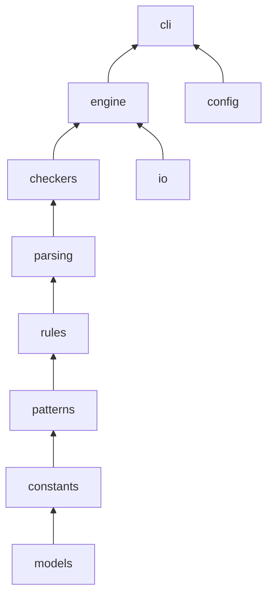

# Blinter Architecture

Blinter is a read-only static analyzer for Windows batch files (`.bat`, `.cmd`). It does not execute batch code; it parses source text and applies rule checkers.

## Module map

```
src/blinter/
  __init__.py          # Public API (library and CLI entry re-exports)
  models.py            # BlinterConfig, LintIssue, Rule, RuleSeverity
  constants.py         # Shared constants (BUILTIN_VARS, MAX_FILE_SIZE_BYTES, ...)
  patterns.py          # Dangerous-command and syntax patterns
  rules/
    registry.py        # RULES dict (single source of rule metadata)
    helpers.py         # _create_rule, _add_issue, severity helpers
  parsing/
    structure.py       # Labels, SET variables, script structure
    context.py         # Comment/safe-context helpers
    embedded.py        # PowerShell/VBScript block detection
  checkers/
    orchestration.py   # _process_file_checks, _filter_issues_by_config
    syntax.py          # Error-level syntax rules
    warnings.py        # Warning-level rules
    style.py           # Style rules
    security.py        # Security rules
    performance.py     # Performance rules
    vars.py            # Variable rules
    line_endings.py    # Line-ending rules (E018, etc.)
    advanced/          # Split from former advanced.py (facade __init__.py)
    globals/           # Split from former globals.py (facade __init__.py)
  engine/
    linter.py          # lint_batch_file() orchestration
    dependencies.py    # CALL graph and cross-script variable collection
  io/
    encoding.py        # read_file_with_encoding, size limits
    discovery.py       # find_batch_files, is_path_under_root
  config/
    loader.py          # blinter.ini loading
  output/
    formatters.py      # CLI output formatting
  cli/
    args.py            # Argument parsing
    main.py            # CLI orchestration and multi-file processing
```

## Data flow



1. **Input** — `read_file_with_encoding` reads the batch file; encoding is detected via `charset_normalizer` with fallbacks.
2. **Structure** — Labels, SET variables, delayed expansion, and embedded script blocks are analyzed.
3. **Checkers** — Line and global rules run via `orchestration._process_file_checks`.
4. **Filter** — `BlinterConfig`, inline `REM LINT:IGNORE` comments, and severity filters apply.
5. **Output** — `LintIssue` list returned to library callers or formatted by the CLI.

## Public vs internal imports

**Supported public API** (import from `blinter`):

- `lint_batch_file`, `read_file_with_encoding`, `find_batch_files`
- `load_config`, `create_default_config_file`, `main`
- `BlinterConfig`, `LintIssue`, `Rule`, `RuleSeverity`
- `__version__`, `__author__`, `__license__` — `__version__` is read from `[project].version` in `pyproject.toml` when developing from a source checkout; otherwise it uses installed package metadata (`importlib.metadata`), with a final fallback to parsing `pyproject.toml` (see `_version.py`).

**Internal / extension imports** (import from subpackages):

```python
from blinter.rules.registry import RULES
from blinter.checkers.syntax import _check_syntax_errors
from blinter.checkers.advanced import _check_advanced_escaping_rules
from blinter.checkers.globals import _check_unreachable_code
```

Only symbols listed in `blinter.__all__` are stable for external integrators. Checker facades (`blinter.checkers.advanced`, `blinter.checkers.globals`) re-export symbols for tests and advanced use; keep their `__all__` lists in sync when moving functions between submodules.

## Checker refactor (advanced / globals)

Former monolithic modules were split into subpackages with facade `__init__.py` files that re-export all symbols. `orchestration.py` imports from the facades, so call sites do not need deep paths like `blinter.checkers.globals.exit_flow`.

When adding or moving a checker function:

1. Place it in the appropriate submodule under `advanced/` or `globals/`.
2. Add the symbol to that subpackage's `__init__.py` and `__all__`.
3. If `orchestration.py` calls it, ensure the facade export exists.

## Thread safety

`lint_batch_file` and `read_file_with_encoding` are designed for concurrent use: they use local state and immutable global rule metadata. The CLI runs single-threaded. `RULES` is read-only at runtime.

## `--follow-calls` and `scan_root`

When `follow_calls` is enabled, Blinter resolves `CALL` targets to read variables and optionally lint called scripts. The CLI sets `BlinterConfig.scan_root` to the target directory (or the parent of a single file) so paths outside the scan root are not read or processed. `lint_batch_file()` defaults `scan_root` to the batch file's parent directory when unset, matching CLI containment for library callers.

## Configuration

`BlinterConfig` controls recursion, rule enablement, `max_line_length`, `follow_calls`, `scan_root`, and severity filtering. Values can be loaded from `blinter.ini` and overridden by CLI flags.
