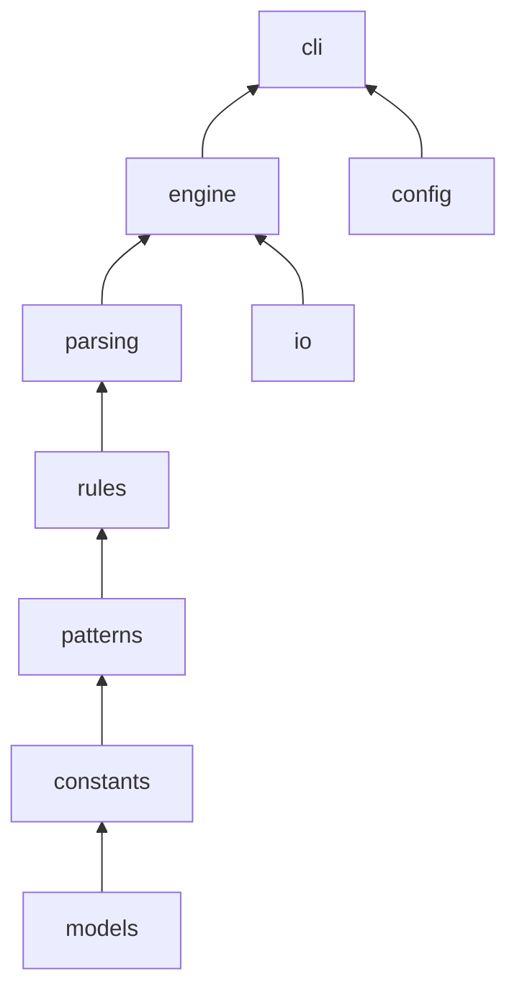

# Blinter Architecture

Blinter is a read-only static analyzer for Windows batch files (`.bat`, `.cmd`). It does not execute batch code; it parses source text through a unified ANTLR-first visitor pipeline.

## Module map

```
src/blinter/
  __init__.py          # Public API (library and CLI entry re-exports)
  models.py            # BlinterConfig, LintIssue, Rule, RuleSeverity
  constants.py         # Shared constants (BUILTIN_VARS, MAX_FILE_SIZE_BYTES, ...)
  patterns.py          # Dangerous-command and syntax patterns (generated from SSOT)
  rules/
    registry.py        # RULES dict (generated from spec/data/rules.yaml)
    helpers.py         # _create_rule, _add_issue, severity helpers
  parsing/
    ast_pipeline.py    # lint_via_ast() — unified AST-first orchestration
    grammar_rules.py   # Grammar-backed rule codes (generated from rules.yaml)
    preprocessor.py    # Line continuations, line number mapping
    antlr_bridge.py    # ANTLR lex/parse
    structure.py       # Labels, SET variables, script structure
    embedded.py        # PowerShell/VBScript block detection
    visitors/
      syntax_visitor.py      # Grammar-backed syntax (E009, E011, E017, E019, E030-E033)
      structure_visitor.py   # Structural syntax rules
      encoding_visitor.py    # Encoding and line-ending rules
      flow_visitor.py        # Control-flow and global analysis
      symbol_visitor.py      # Variable/symbol analysis
      setlocal_visitor.py    # SETLOCAL nesting rules
      heuristic_visitors.py  # SEC/W/P/S heuristic visitors
      rule_impl/             # Rule implementation helpers (invoked by visitors)
  engine/
    linter.py          # lint_batch_file() entry point
    dependencies.py    # CALL graph and cross-script variable collection
  checkers/            # Backward-compatible module aliases (re-export rule_impl)
  io/
    encoding.py        # read_file_with_encoding, size limits
    discovery.py       # find_batch_files, is_path_under_root
  config/
    loader.py          # blinter.ini loading
  output/
    formatters.py      # CLI output formatting
    json_formatter.py  # JSON report serialization
  cli/
    args.py            # Argument parsing
    main.py            # CLI orchestration and multi-file processing
```

## Data flow


```mermaid
flowchart BT
  models --> constants
  constants --> patterns
  patterns --> rules
  rules --> parsing
  parsing --> engine
  engine --> cli
  config --> cli
  io --> engine
```

1. **Input** — `read_file_with_encoding` reads the batch file; encoding is detected via `charset_normalizer` with fallbacks.
2. **Structure** — Labels, SET variables, delayed expansion, and embedded script blocks are analyzed.
3. **AST pipeline** — `lint_via_ast()` runs encoding, structure, heuristic, flow, symbol, and grammar-backed visitor passes.
4. **Filter** — `BlinterConfig`, inline `REM LINT:IGNORE` comments, and severity filters apply.
5. **Output** — `LintIssue` list returned to library callers, or formatted by the CLI.

## Public vs internal imports

**Supported public API** (import from `blinter`):

- `lint_batch_file`, `read_file_with_encoding`, `find_batch_files`
- `load_config`, `create_default_config_file`, `main`
- `BlinterConfig`, `LintIssue`, `Rule`, `RuleSeverity`
- `__version__`, `__author__`, `__license__`

**Internal / extension imports**:

```python
from blinter.rules.registry import RULES
from blinter.parsing.ast_pipeline import lint_via_ast
from blinter.parsing.visitors.syntax_visitor import check_ast_syntax_rules
```

Only symbols listed in `blinter.__all__` are stable for external integrators. The `blinter.checkers` package remains as backward-compatible aliases to `parsing.visitors.rule_impl`.

## Thread safety

`lint_batch_file` and `read_file_with_encoding` are designed for concurrent use. Per-lint invocation-prefix data uses a `contextvars.ContextVar` cache reset at each `lint_batch_file` call.

## Configuration

`BlinterConfig` controls recursion, rule enablement, `max_line_length`, `follow_calls`, `scan_root`, and severity filtering. Values can be loaded from `blinter.ini` and overridden by CLI flags.

## SSOT split: batch-spec vs Blinter

| Artifact | Repo / path |
|----------|-------------|
| ANTLR grammar, expansion rules, command catalog, cmd-help | [`vendor/batch-spec`](../../vendor/batch-spec) ([`tboy1337/batch-spec`](https://github.com/tboy1337/batch-spec), pinned in [`spec/batch-spec.lock`](../../spec/batch-spec.lock)) |
| [`spec/data/rules.yaml`](../../spec/data/rules.yaml) | Rule catalog (all `checker: ast`; see `RULE_COUNT`) |
| [`spec/data/commands-linter.yaml`](../../spec/data/commands-linter.yaml) | Security/style command policy (merged with batch-spec `commands.yaml` for `patterns.py`) |
| [`spec/corpus/`](../../spec/corpus/) | 202 committed fixtures + `expect.json` oracles |
| [`spec/audit/`](../../spec/audit/) | Reference matrix and audit baselines |

Clone with `git clone --recurse-submodules` or run `git submodule update --init --recursive`
after checkout.

Generators live under [`scripts/spec/`](../scripts/spec/). `scripts/verify.py` runs schema validation, generator `--check`, strict SSOT audit, cmd.exe oracle (Windows), linting, and tests.

**cmd.exe oracle:** [`scripts/spec/cmd_oracle.py`](../scripts/spec/cmd_oracle.py) runs safe corpus fixtures in isolated `cmd /c` subprocesses (currently **167 runnable**, **19 skipped** with default 3s timeout). Skips use an explicit denylist ([`oracle-skip.yaml`](../spec/corpus/meta/oracle-skip.yaml)) plus refined content heuristics (not a blanket security skip). Per-case overrides in `expect.json`: `"oracle": "skip"` / `"oracle": "run"` and `"oracle_timeout_s"`. Destructive, interactive, or long-running fixtures remain static-only; echo/set-only security fixtures run as smoke tests.

Corpus policy: every rule in `rules.yaml` must have at least one corpus assertion (see `audit_ssot.py` coverage checks).

### AST-first parsing pipeline

All rules are implemented through AST-aware visitors (`checker: ast` in `rules.yaml`):

1. [`parsing/preprocessor.py`](parsing/preprocessor.py) — join `^` continuations, map line numbers
2. [`parsing/antlr_bridge.py`](parsing/antlr_bridge.py) — ANTLR lex/parse
3. [`parsing/ast_pipeline.py`](parsing/ast_pipeline.py) — orchestrates visitor passes
4. [`parsing/visitors/`](parsing/visitors/) — syntax, structure, encoding, flow, symbol, setlocal, and heuristic visitors

Grammar-backed rules (those with `grammar_nodes` in `rules.yaml`) use `SyntaxLintVisitor` on the parse tree. Security, performance, and style rules use heuristic visitors that walk command nodes and apply pattern libraries.
